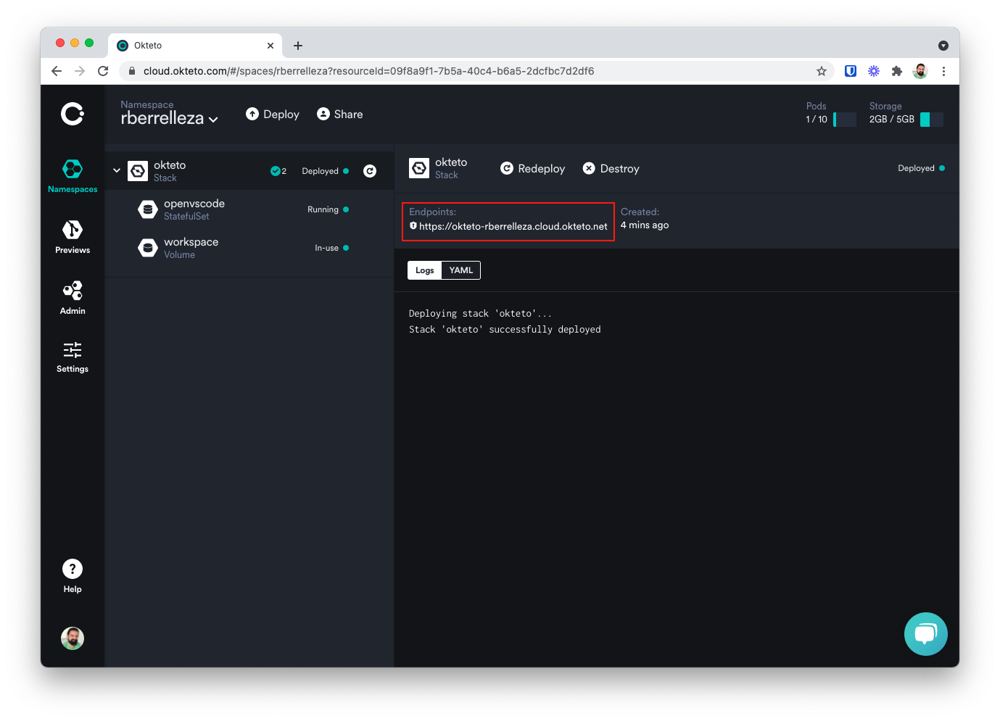

# Deploy OpenVSCode Server to Okteto

## Prerequisites

To complete this guide, you need:
* an [Okteto Cloud](https://okteto.com/) account

## Deploy OpenVSCode Server

To deploy to Okteto, click the following button:

## Access OpenVSCode Server

When the deployment is complete, you will see your server listed in the Dashboard. Click the dashboard entry to see the URL of your OpenVSCode Server.

## Teardown

Delete the deployment in the Okteto Cloud dashboard.
